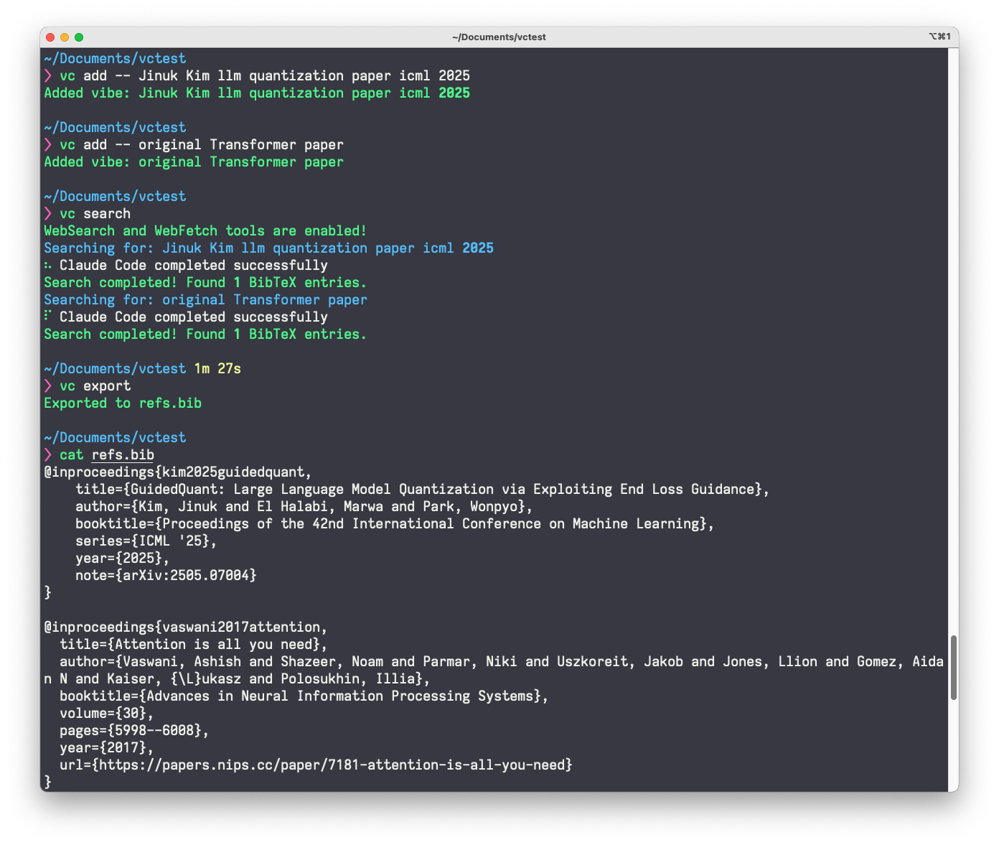

# vibecite

A minimal CLI that turns natural-language paper descriptions into curated citations (bibtex format) by delegating search and formatting to Claude Code.

<div align="center">

</div>

## Installation

```bash
# Install from local directory
pip install -e .

# Or install with uv
uv pip install git+https://github.com/jusjinuk/vibecite

# Or run directly with uvx
uvx --from git+https://github.com/jusjinuk/vibecite vc
```

## Requirements

- Python 3.9+
- [Claude Code](https://claude.ai/code) CLI installed and available in your PATH

## Usage

### Basic workflow

```bash
# Initialize a project
vc init --bib refs.bib

# Add paper descriptions ("vibes") using the -- syntax
vc add -- jinuk kim icml 2025 llm quantization paper

# (Optional) List current session status
vc ls

# Search for papers (delegates to Claude Code with progress feedback)
vc search

# (Optional) Check the results
vc ls

# Export to BibTeX
vc export --bib refs.bib
```

### Commands

- `vc init [--bib FILE]` - Initialize or continue a bibliography project
- `vc add -- DESCRIPTION` - Add a paper vibe using natural language
- `vc search` - Search for papers using Claude Code (shows progress)
- `vc export [--bib FILE]` - Export collected citations to BibTeX
- `vc ls` - Show current session status
- `vc clear` - Clear current session

## License

MIT
